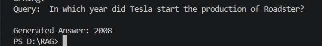
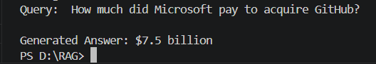

# RAG-Based Document Question Answering System

## Overview

This project implements a Retrieval-Augmented Generation (RAG) system that answers user queries based on a collection of documents. It combines semantic search using vector embeddings with answer generation using a language model.

---

## Tech Stack

* Python
* LangChain
* ChromaDB (Vector Database)
* SentenceTransformers (Embeddings)
* HuggingFace Transformers (Flan-T5 for generation)

---

## Project Structure

```
RAG/
│── docs/                  # Input text documents
│── db/chroma_db/         # Stored vector database
│── ingest.py             # Document loading + chunking + embedding
│── retrieval_pipeline.py # Retrieval + answer generation
│── requirements.txt
```

---

## Workflow

### 1. Document Loading

* Text files are stored in the `docs/` directory.
* Documents are loaded using LangChain’s DirectoryLoader.
* Each file is converted into structured document objects.

---

### 2. Text Chunking

* Large documents are split into smaller chunks.
* Improves retrieval accuracy and efficiency.
* Helps the model process relevant context only.

---

### 3. Embedding Generation

* Each chunk is converted into a vector using SentenceTransformers.
* Model used:

  * `sentence-transformers/all-MiniLM-L6-v2`
* These embeddings capture semantic meaning of text.

---

### 4. Vector Storage (ChromaDB)

* Embeddings are stored in ChromaDB.
* Cosine similarity is used for comparison.
* Database is persisted locally for reuse.

---

### 5. Retrieval

* User query is converted into an embedding.
* Top-k similar document chunks are retrieved using cosine similarity.
* Only the most relevant context is selected.

---

### 6. Answer Generation

* Retrieved chunks are combined into a context.
* A prompt is constructed using:

  * Context
  * User query
* The prompt is passed to a Flan-T5 model using HuggingFace Transformers.
* Answer is generated using `model.generate()` (Seq2Seq approach).

---

### 7. Output Cleaning

* The generated output is post-processed to remove noise.
* Only the most relevant part (e.g., year or sentence) is returned.

---

## Pipeline Flow

```
User Query
   ↓
Convert to Embedding
   ↓
Vector Search (ChromaDB)
   ↓
Top-k Relevant Chunks
   ↓
Context + Query → Prompt
   ↓
Flan-T5 Model (Seq2Seq Generation)
   ↓
Cleaned Final Answer
```

---

## Example

### Input

```
Question: In which year did Tesla start the production of Roadster?
```

### Output

```
2008
```

---

## Key Concepts

* Embeddings
* Cosine Similarity
* Vector Databases
* Semantic Search
* Retrieval-Augmented Generation (RAG)

---

## Important Implementation Notes

* Context length is limited to avoid token overflow.
* Only top-k relevant chunks are used to improve accuracy.
* Flan-T5 is used via `AutoModelForSeq2SeqLM` instead of pipeline due to compatibility issues.
* Output is cleaned using string processing and regex.

---
## Results

The system was tested with sample queries, and it successfully retrieved relevant context and generated accurate answers.

### Sample Output 1



### Sample Output 2



---

## Observations

* The system correctly retrieves relevant document chunks using semantic search.
* The generated answers are concise and based only on retrieved context.
* Output cleaning ensures clear and readable final responses.

---

## Future Improvements

* Use RecursiveCharacterTextSplitter for better chunking
* Upgrade embeddings to multilingual models
* Integrate Gemini or larger LLMs for better answers
* Build a chatbot UI (React + Node.js)
* Deploy as a web application

---

## Conclusion

This project demonstrates a complete RAG pipeline using open-source tools. It effectively combines semantic retrieval with language model generation to answer questions based on document context.
